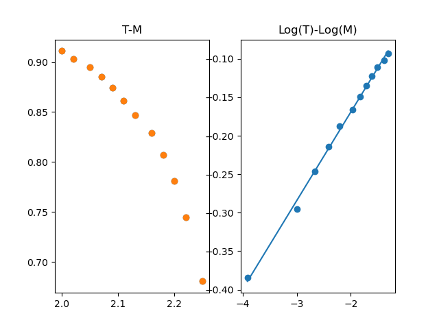
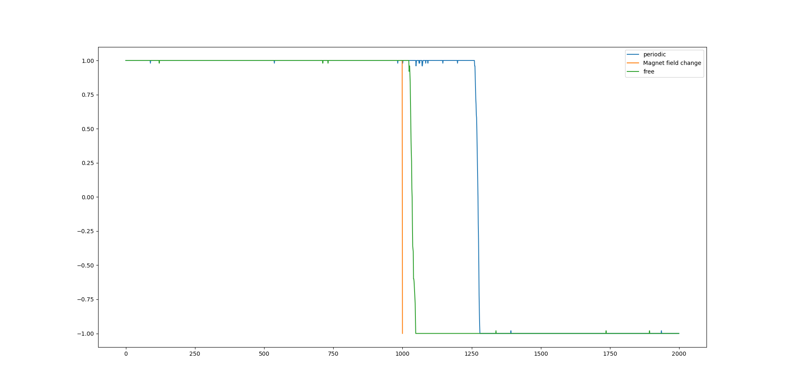

## 计算物理第11次作业

**吴远清 2018300001031**

## 作业一

### 分析

由于蒙特卡洛模拟是随机过程模拟, 并且在此过程中, 可能出现不可逆过程. (例如,对于铁磁相的物质, 设其内部磁畴处于杂乱分布. 初始时轻微的扰动(随机过程), 均会使其向全体磁畴呈+1/-1的相坍缩.). 因此, 对于每一次模拟, 我们需要经历足够长的时间, 以使其充分平衡. 另外, 对于一组给定的参数, 我们应当从初始值出发, 多次进行模拟, 以避免自发对称破缺导致的偶然结果.

### 代码实现

由于计算量较大, 我们使用`c++`进行计算, 得到的数据输出后使用`python`进行拟合和处理.

首先, 我们将Ising模型抽象为一个类:

```c++
//ising_model.h
// Created by yqwu on 29/11/2020.
//

#ifndef UNTITLED_ISING_MODEL_H
#define UNTITLED_ISING_MODEL_H

#endif //UNTITLED_ISING_MODEL_H

#pragma once

class ising_model
{
public:
    ising_model(unsigned int L, unsigned int N, float J, float kB, float T, float H, float Mu, unsigned int boudary);
    ~ising_model();
    void update();
    float run(int run_step);
	float* M;
    void set_magnet_field(float H);
private:
    int** spin;
    float j, kb, t, h, mu;
    unsigned int size, steps, boundary_condition, current_step;
    bool flip(int* s, unsigned int n);
    void bound_process(unsigned int i, unsigned int j);
    void statistic(unsigned int i);
};
```

之后是具体实现;

```c++
//ising_model.cpp
// Created by yqwu on 29/11/2020.

#include "ising_model.h"
#include <cmath>
#include <cstdlib>
#include <ctime>
#include <fstream>
#include <sstream>
#include <iostream>

using namespace std;

ising_model::ising_model(unsigned int L, unsigned int N, float J, float kB, float T, float H, float Mu, unsigned int boudary)
{
    srand(time(NULL));
    j = J;
    size = L;
    steps = N;
    kb = kB;
    t = T;
    h = H;
    mu = Mu;
    current_step = 0;
    spin = new int* [size];
    boundary_condition = boudary;
    for(auto i = 0; i < size; i++)
    {
        spin[i] = new int[size];
    }
    for(auto i = 0; i < size; i++)
    {
        for(auto j = 0; j < size; j++)
        {
            spin[i][j] = 1;
            //spin[i][j] = rand() % 2 == 1 ? 1 : -1;
        }
    }
    M = new float[steps];
}

ising_model::~ising_model()
{
    for(auto i = 0; i < size; i++)
    {
        delete[] spin[i];
    }
    delete[] spin;
    delete[] M;
}

bool ising_model::flip(int* s, unsigned int n)
{
    float Ef = 2*mu*h*s[0];
    for(auto i = 1; i < n; i++)
    {
        Ef += 2*j*s[0]*s[i];
    }
    if(Ef<0)
    {
        return true;
    }
    else
    {
        if (rand() < exp(-Ef / (kb * t)) * RAND_MAX)
        {
            return true;
        }
        else
        {
            return false;
        }
    }

}


void ising_model::bound_process(unsigned int i, unsigned int j)
{
    switch (boundary_condition)
    {
        case 0:			//Period boundary condition.
        {
	        int s[5] = {spin[i][j], spin[(i + 1) % size][j], spin[i == 0 ? size - 1 : i - 1][j],
	                    spin[i][(j + 1) % size], spin[i][j == 0 ? size - 1 : j - 1]};
	        if (flip(s, 5)) {
		        spin[i][j] = -1 * spin[i][j];
	        }
        }
        case 1:         //Free boundary condition
        {
	        if ((i == 0 || i == size-1) && (j == size - 1 || j == 0))        //Corner
	        {
		        int s[3] = {spin[i][j], spin[i == 0 ? 1 : size - 2][j], spin[i][j == 0 ? 1 : size - 2]};
		        if (flip(s, 3)) {
			        spin[i][j] = -1 * spin[i][j];
		        }
	        }
	        else                                                //Edge
	        {
		        if (i == 0 || i == size - 1) {
			        int s[4] = {spin[i][j], spin[i == 0 ? 1 : size - 2][j], spin[i][j + 1], spin[i][j - 1]};
			        if (flip(s, 4)) {
				        spin[i][j] = -1 * spin[i][j];
			        }
		        }
		        else {
			        int s[4] = {spin[i][j], spin[i][j == 0 ? 1 : size - 2], spin[i + 1][j], spin[i - 1][j]};
			        if (flip(s, 4)) {
				        spin[i][j] = -1 * spin[i][j];
			        }
		        }
	        }
        }
    }
}


void ising_model::update()
{
    for(auto i = 0; i < size; i++)
    {
        for(auto j = 0; j < size; j ++)
        {
            //cout << i << " " << j << endl;
            if(i==0 || j==0 || i==size-1 || j==size-1)
            {
                bound_process(i, j);
            }
            else
            {
                int s[5] = { spin[i][j], spin[i + 1][j] ,spin[i - 1][j] ,spin[i][j + 1] ,spin[i][j - 1] };
                if(flip(s, 5))
                {
                    spin[i][j] = -1 * spin[i][j];
                }
            }
        }
    }
}

void ising_model::statistic(unsigned int i)
{
    float tot_m = 0;
    for(auto i = 0; i < size; i++)
    {
        for(auto j = 0; j < size; j++)
        {
            tot_m += spin[i][j];
        }
    }
    //cout << tot_m/(size*size) << endl;
    M[i] = tot_m/(size*size);
}

float ising_model::run(int run_step)
{

	if (run_step==0)
	{
		run_step = steps - current_step;
	}
    float totM = 0;
    for(int j=0; j < run_step; current_step++,j++)
    {
        update();
        statistic(current_step);
        totM += M[current_step];
    }
    return totM/steps;
}

void ising_model::set_magnet_field(float H) {
	h = H;
	//cout << "Magnetic filed amplitude has change:" << h << endl;
}
```

之后调用这个类,进行模拟, 在这里, 我们的参数T取值范围为0.1~3.0, 取值间距0.01, 共取290个参数值. 对于每个参数值, 我们在10x10的模型上模拟1000步, 这样的过程对于每个参数值重复200次, 取平均得到相应的$M$.

```c++
void Q1()
{
	float t = 0.1, end = 3.0, step = 0.01;
	unsigned int repeat = 200;
	while(t < end)
	{
		float totM = 0;
		for(auto i = 0; i < repeat; i++)
		{
			ising_model I(10, 1000, 1, 1, t, 0, 0.1, 0);
			totM += I.run(0);
		}
		std::cout << t << "," << totM/repeat << std::endl;
		t += step;
	}
}
```

### 结果分析



可以明显看出相变的过程.

按照题目所给方式进行拟合:

```pyrhon
import matplotlib.pyplot as plt
import numpy as np

if __name__ == '__main__':
    T,M = [],[]
    Tn, Mn, Nn = [],[],[]
    Tc = 2.27
    with open("Q1.txt","r") as fp:
        datas = fp.readlines()
    for data in datas:
        T.append(float(data.split(",")[0]))
        M.append(float(data.split(",")[1]))
    for i in range(len(T)):
        if T[i] in Tn:
            idx = Tn.index(T[i])
            Mn[idx] += abs(M[i])
            Nn[idx] += 1
        else:
            Tn.append(T[i])
            Mn.append(abs(M[i]))
            Nn.append(1)
    for i in range(len(Tn)):
        Mn[i] = Mn[i]/Nn[i]
    Tn = np.array(Tn)
    Mn = np.array(Mn)
    idx = Tc - Tn > 0
    Tn = Tn[idx]
    Mn = Mn[idx]
    LogT = np.log(Tc-Tn)
    LogM = np.log(Mn)
    popt = np.polyfit(LogT, LogM, deg = 1)
    print(popt)
    x = np.linspace(np.min(LogT), np.max(LogT), 50)
    plt.subplot(1,2,1)
    plt.title("T-M")
    plt.scatter(T, M)
    plt.scatter(Tn, Mn)
    plt.subplot(1,2,2)
    plt.title("Log(T)-Log(M)")
    plt.scatter(LogT,LogM)
    plt.plot(x, popt[0]*x + popt[1])
    plt.show()
```

结果为:
$$
\beta = 0.115
$$

$$
Tc = 2.039
$$

可见,$\beta$的值很接近1/8, $T_c$也确实位于$2\sim 2.27$之间.

## 作业二

### 分析

与题目中要求的顺序不符, 我们先对不同的边界条件进行理论分析.

首先, 不管对于何种边界条件, 控制内部磁畴翻转的都是$E_{flip}$, 我们考虑已完全磁化的磁体, 假设其内部磁畴朝向均为$+1$,与$t_0$时刻的外加磁场同向.

对于非边界的磁畴,不同的边界条件没有影响, 而对于边界上的磁畴, 则有所不同.

对于周期性边界条件, 当磁场翻转后(与磁化方向相反):
$$
E_{flip} = 8J - 2\mu H
$$
而对于自由边界条件, 由于其仅有两个/三个临近磁畴,其翻转能量为:
$$
E_{flip} = 6J-2\mu H\qquad(for \;edge)
$$
或:
$$
E_{flip} = 4J-2\mu H\qquad (for\;corner)
$$
意味着,相较于周期性边界条件, 自由边界条件下,边界上的磁畴更容易翻转.

如果考虑实际中的磁体, 由于磁体体积相较于边界的单层原子要大许多,因此周期性边界条件应当更加适合.

### 代码实现

仍然基于题一中的代码, 事实上, 在题一的代码中, 我们已经实现了自由边界条件.

具体计算代码如下:

```c++
void Q2() {
	{
		ising_model I(10, 2000, 1, 1, 0.5, 0, 0.5, 0);
		I.set_magnet_field(1.5);
		I.run(1000);
		I.set_magnet_field(-1.5);
		I.run(0);
		for (auto i = 0; i < 2000; i++) {
			std::cout << I.M[i] << ",";
		}
		std::cout << std::endl;
	}
	{
		ising_model I(10, 2000, 1, 1, 0.5, 0, 0.5, 1);
		I.set_magnet_field(1.5);
		I.run(1000);
		I.set_magnet_field(-1.5);
		I.run(0);
		for (auto i = 0; i < 2000; i++) {
			std::cout << I.M[i] << ",";
		}
		std::cout << std::endl;
	}
}
```

数据分析代码如下:

```python
import numpy as np
import matplotlib.pyplot as plt

if __name__ == '__main__':
    with open('./cmake-build-debug/Q2.data','r') as fp:
        data = fp.readlines()
    H1,H2,H3 = [],[],[]
    for i in data[0].split(',')[:-1]:
        H1.append(float(i))
    for i in data[1].split(',')[:-1]:
        H2.append(float(i))
    B,t = [1,-1],[999,1000]
    print(H1,H2)
    T = range(len(H1))
    plt.plot(T,H1, label = 'periodic')
    plt.plot(t,B, label = 'Magnet field change')
    plt.plot(T,H2,label = 'free')
    plt.legend();
    plt.show()
```

### 结果分析



结果如图, 可以明显看出, 对于两种边界条件, 均存在磁滞现象, 但是自由边界条件更快速的翻转到与磁场方向相同的状态. 这与我们的理论预期相符.